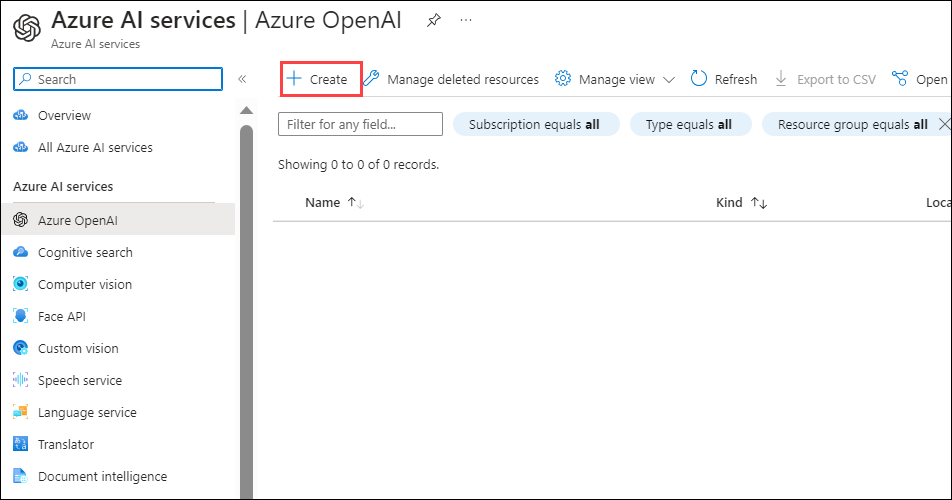
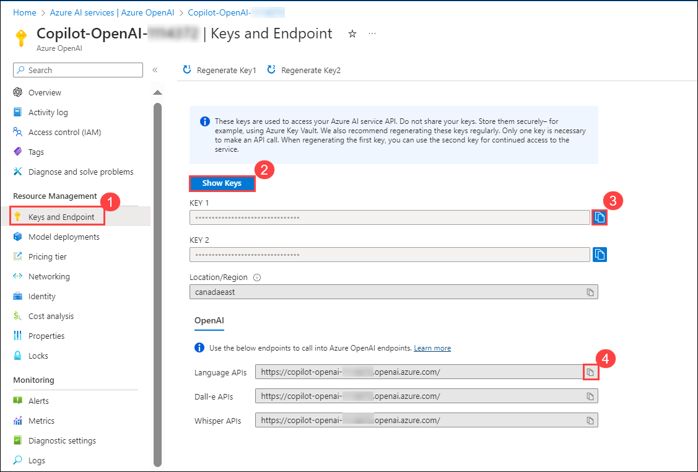
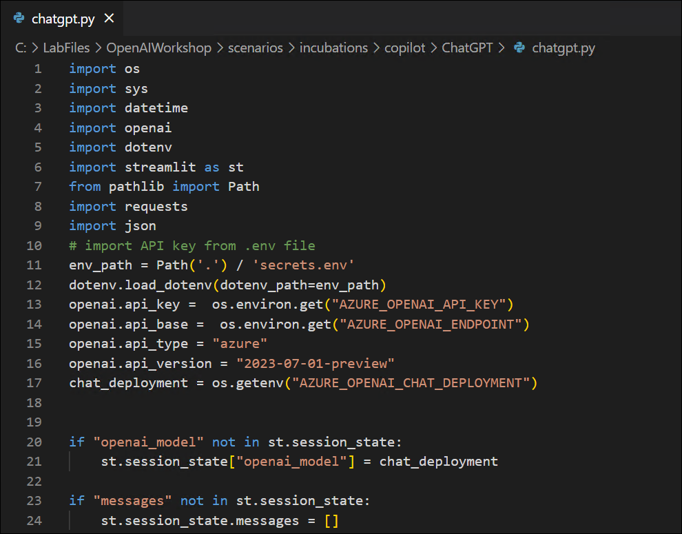
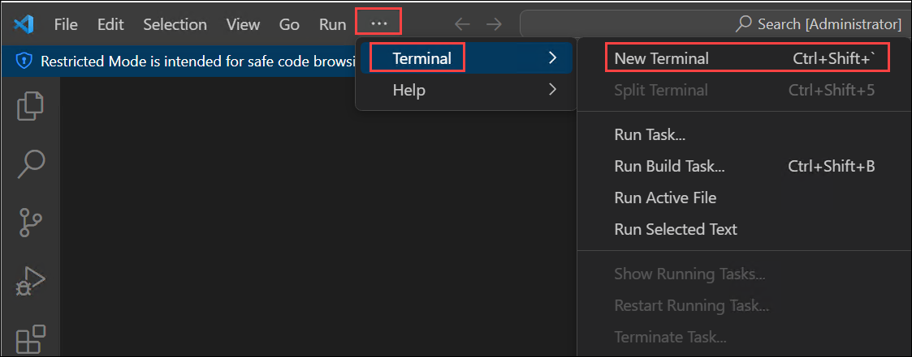
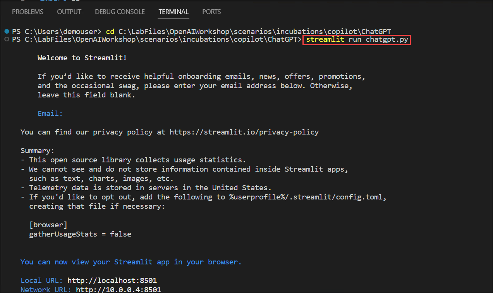
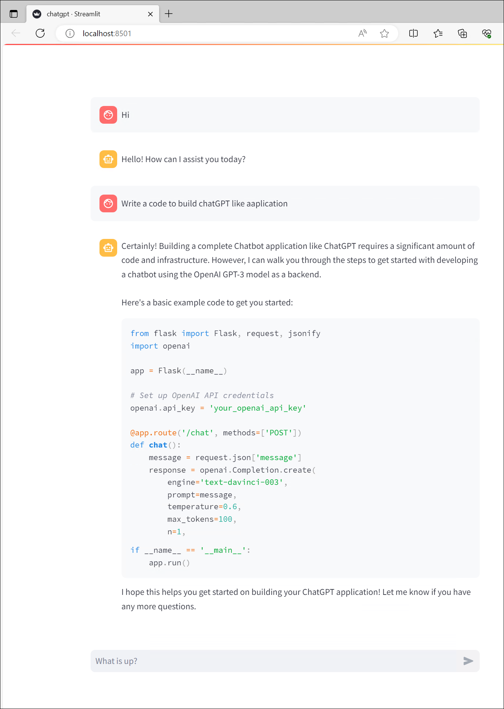

# Lab 1: Getting Started with Building a Chat Application

## Exercise 1: Open AI Setup and Installation of Applications

In this exercise, you will be setting up the Open AI resource and installing the application locally.

### Task 1: Create an OpenAI resource and model (read-only)

 > **Note:** This task is **READ-ONLY**. The OpenAI setup is already configured for your environment.

1. In the Azure portal, search for **Azure OpenAI** **(1)** in the top search box, then select **Azure OpenAI** **(2)** under services.

   
   
1. From the **Cognitive Services | Azure OpenAI** pane, click on **Create**.

   
   
1. In the **Create Azure OpenAI** pane under the **Basics** tab, select the default subscription and select the existing **copilot-openai-<inject key="Deployment ID" enableCopy="false"/>** resource group. Select **East US** as Region, enter Name as **copilot-openai-<inject key="Deployment ID" enableCopy="false"/>** and select **Standard S0** for Pricing Tier. Click on **Next**.

   
   
1. Leave default settings for the Network and Tags tabs and click on **Next**.

1. Verify that validation has passed in the **Review + Submit** pane, and then click on **Create**.

   
   
1. Deployment will take 5 minutes to complete. Once the deployment is successful, click on **Go to Resource**.

   
   
1. In the Azure OpenAI resource pane, select **Go to Azure OpenAI Studio**.

   
   
1. In the Azure OpenAI Studio, click **Deployment (1)** and click **+ Create new deployment (2)**.

   
   
1. On the **Deploy Model** tab, enter the following details and click on **Create (5)**.

   - Select a model: **gpt-35-turbo (1)**
   - Model version: **Auto-update to default (2)**
   - Deployment name: **Copilot-model (3)**
   - Tokens per Minute Rate Limit (thousands): **15K (4)**

   
   
### Task 2: Building a ChatGPT-like application on Streamlit with streaming  

1. Navigate to the OpenAI resource on the **Azure portal**, click on **Go to Azure OpenAI Studio**, and it will navigate to **Azure OpenAI Studio**.

   
      
1. In the **Azure OpenAI Studio**, select **Deployments** under Management and verify that the **gpt-35-turbo** and **text-embedding-ada-002** models are present with the deployment names as **copilot-gpt** and **text-embedding-ada-002**. Review that the model's capacity is set to **15K TPM**. Copy the OpenAI deployment names and model names into the text file for later use.
   
   

1. Navigate back to the OpenAI resource on the **Azure portal**, select **Key & Endpoint (1)** from the left menu, and click on **Show Keys (2)**. Copy the **KEY 1 (3)** and **Language APIs (4)**, and store them in a text file for later use.

   
   
1. Navigate back to **Azure OpenAI**, select **Cognitive search (1)** from the left menu, and click on **copilot-openai-<inject key="Deployment ID" enableCopy="false"/> (2)**.

   

1. From the Overview tab of Cognitive Search, copy the **URL** and paste it into a text editor for later use.

   

1. From the left menu, select **Key (1)**, copy the **Primary admin key (2)**, and paste it into a text editor for later use.

   

1. In the LabVM, open File Explorer, navigate to the `C:\LabFiles\OpenAIWorkshop\scenarios\incubations\copilot\ChatGPT` path, right-click on the `secrets.env` file, and select open with  **Visual Studio Code**.

    

1. In the `secrets.env` file, replace the following values with the ones you copied earlier. Press CTRL+S to save the file.

    - **AZURE_OPENAI_API_KEY**: Replace with your OpenAI Key
    - **AZURE_OPENAI_CHAT_DEPLOYMENT**: Replace with your **GPT** OpenAI Deployment Name
    - **AZURE_OPENAI_ENDPOINT**: Replace with your OpenAI **Language APIs Endpoint**

    

1. Navigate back to File Explorer and open `chatgpt.py` with **Visual Studio Code** to view the code to build a ChatGPT-like app.

     
 
1. Next, click on the **Eclipse Button** on the top, then select **Terminal** and click on **New Terminal**.

     

1. Run the below command in the terminal to change the directory.

   ```
   cd C:\LabFiles\OpenAIWorkshop\scenarios\incubations\copilot\ChatGPT
   ```
   
1. To run the application from the command line, navigate back to Command Prompt and run the below command:

   >**Note**: You can enter your email address below to get notifications. If not, please leave this field blank and click on **Enter**.

   ```
   streamlit run chatgpt.py
   ```
   
1. Once the execution of `streamlit run chatgpt.py` is completed, a locally hosted demo application will be opened in the web browser.

   
   
   

1. Explore the app by running a few queries. 

   

Congratulations! You've built your own ChatGPT-like app in 50 lines of code.
