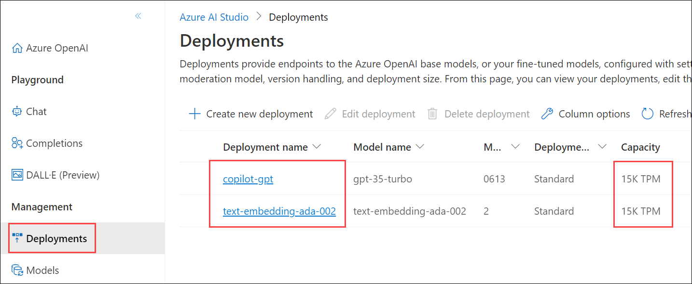

# Lab 1: Getting Started with Building a Chat Application

## Exercise 1: Open AI Setup and Installation of Applications

In this exercise, you will be setting up the Open AI resource and installing the application locally.
   
### Task 1: Building a ChatGPT-like application on Streamlit with streaming  

1. In the Azure portal, search for **Azure OpenAI** **(1)** in the top search box, then select **Azure OpenAI** **(2)** under services.

   

1. From the Azure AI Services | Azure OpenAI pane, select **Copilot-OpenAI-<inject key="Deployment ID" enableCopy="false"/>**.

   

1. In the Azure OpenAI resource pane, select **Go to Azure OpenAI Studio**.

   
      
1. In the **Azure OpenAI Studio**, select **Deployments** under Management and verify that the **gpt-35-turbo** and **text-embedding-ada-002** models are present with the deployment names as **copilot-gpt** and **text-embedding-ada-002**. Review that the model's capacity is set to **15K TPM**. Copy the Azure OpenAI deployment names and model names into the text file for later use.
   
   

1. Navigate back to the Azure OpenAI resource on the **Azure portal**, select **Key & Endpoint (1)** from the left menu, and click on **Show Keys (2)**. Copy the **KEY 1 (3)** and **Language APIs (4)**, and store them in a text file for later use.

   
   
1. Navigate back to **Azure OpenAI**, select **Cognitive search (1)** from the left menu, and click on **copilot-openai-<inject key="Deployment ID" enableCopy="false"/> (2)**.

   

1. From the Overview tab of Cognitive Search, copy the **URL** and paste it into a text editor for later use.

   

1. From the left menu, select **Key (1)**, copy the **Primary admin key (2)**, and paste it into a text editor for later use.

   

1. In the LabVM, open File Explorer, navigate to the `C:\LabFiles\OpenAIWorkshop\scenarios\incubations\copilot\ChatGPT` path, right-click on the `secrets.env` file, and select open with  **Visual Studio Code**.

    

1. In the `secrets.env` file, replace the following values with the ones you copied earlier. Press CTRL+S to save the file.

    - **AZURE_OPENAI_API_KEY**: Replace with your Azure OpenAI Key
    - **AZURE_OPENAI_CHAT_DEPLOYMENT**: Replace with your **GPT** Azure OpenAI Deployment Name
    - **AZURE_OPENAI_ENDPOINT**: Replace with your Azure OpenAI **Language APIs Endpoint**

      

1. Navigate back to File Explorer and open `chatgpt.py` with **Visual Studio Code** to view the code to build a ChatGPT-like app.

     
 
1. Next, click on the **Eclipse Button** on the top, then select **Terminal** and click on **New Terminal**.

     

1. Run the below command in the terminal to change the directory.

   ```
   cd C:\LabFiles\OpenAIWorkshop\scenarios\incubations\copilot\ChatGPT
   ```
   
1. To run the application from the command line, navigate back to Command Prompt and run the below command:

   > **Note**: You can enter your email address below to get notifications. If not, please leave this field blank and click on **Enter**.

   ```
   streamlit run chatgpt.py
   ```
   
1. Once the execution of `streamlit run chatgpt.py` is completed, a locally hosted demo application will be opened in the web browser.

   
   
   

1. Explore the app by running a few queries. Congratulations! You've built your own ChatGPT-like app in 50 lines of code.

   
  
1. Navigate back to **VS Code** and stop the terminal by typing **ctrl + C**.

1. Click the **Next** button located in the bottom right corner of this lab guide to continue with the next exercise.
