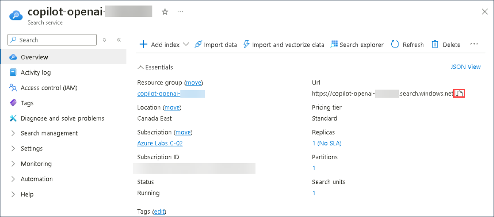
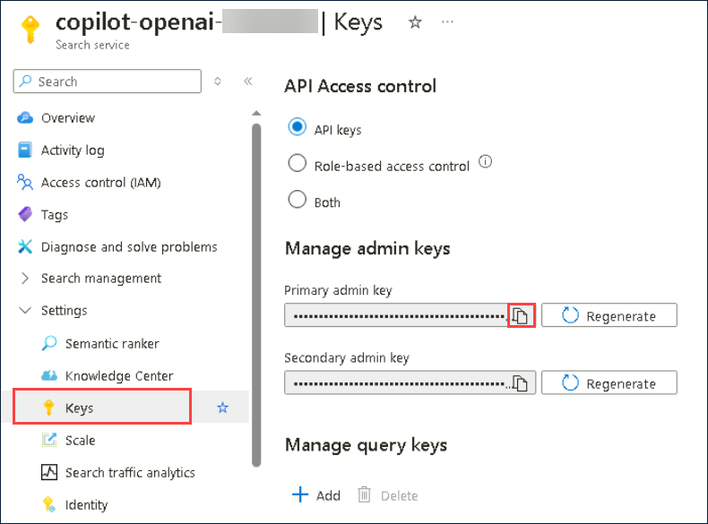
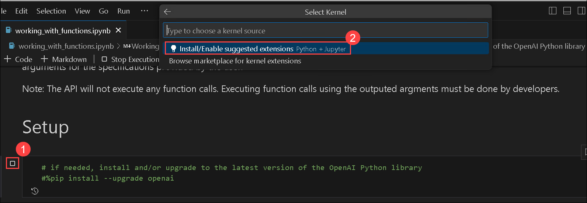
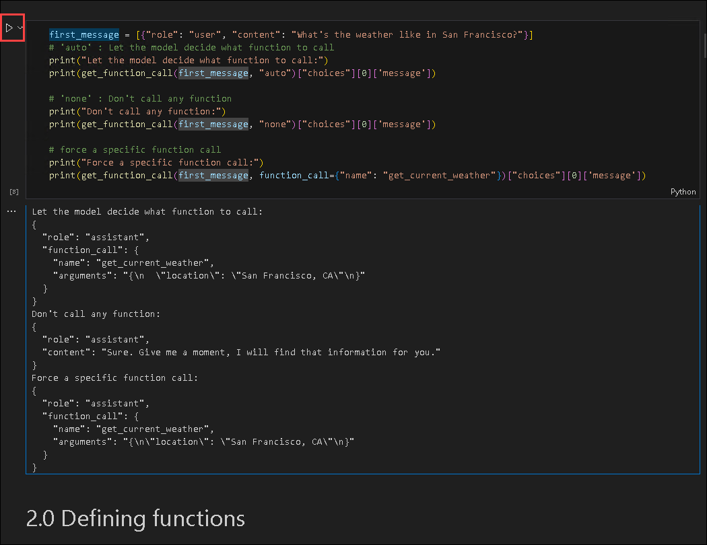
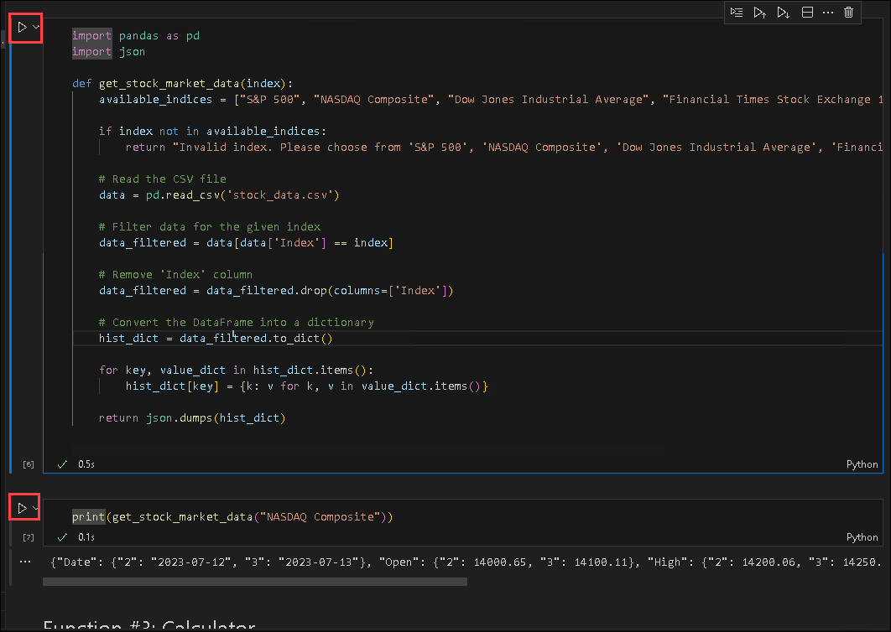
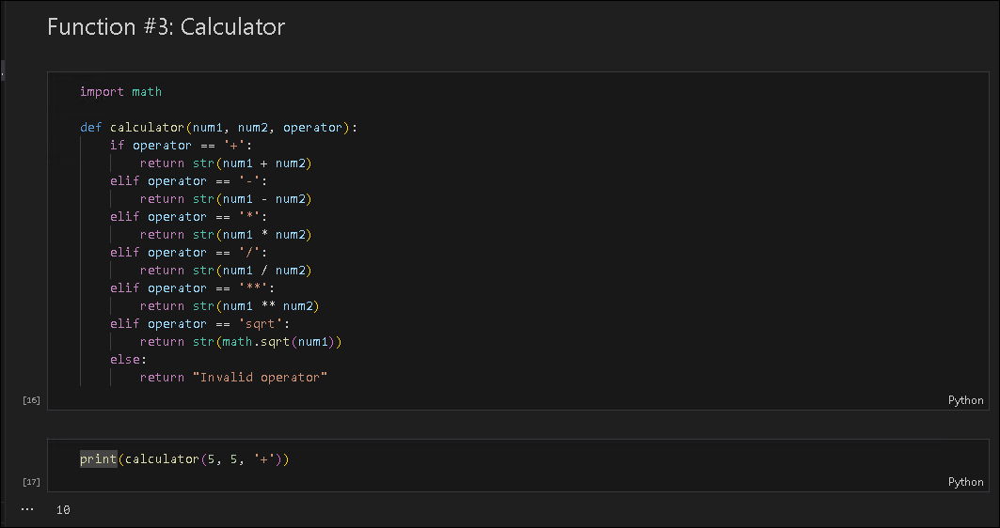
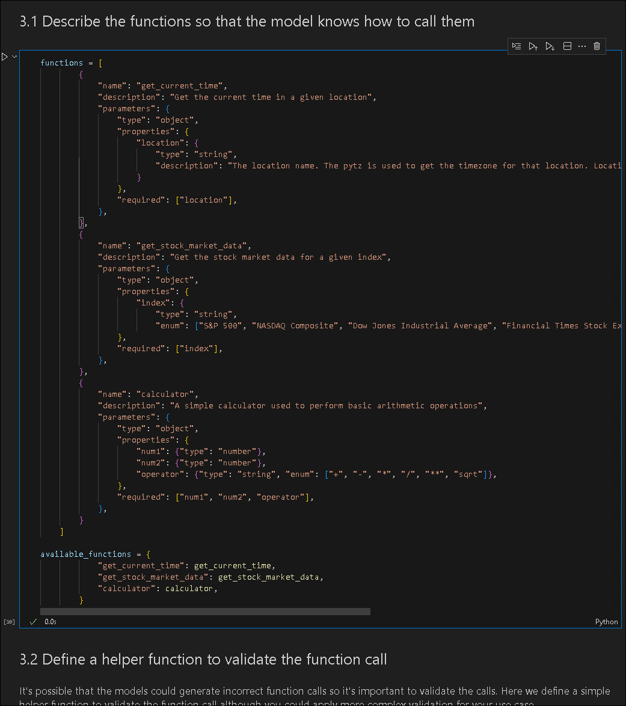
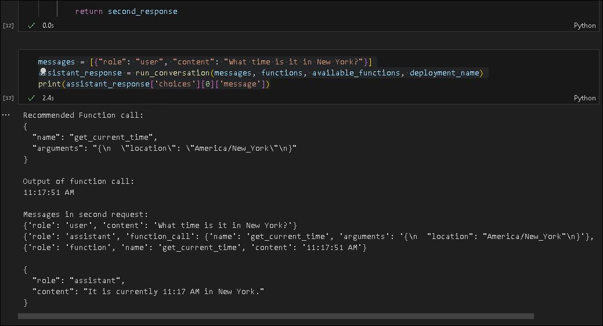
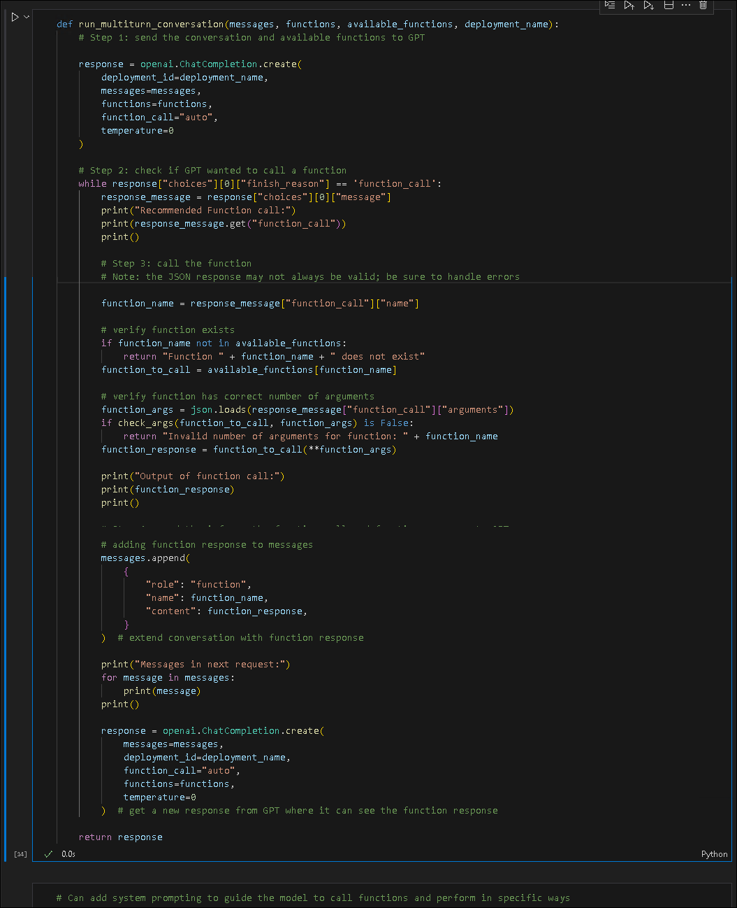

# Lab 2: Dynamic Dialogue Management with OpenAI's Chat API: Leveraging Function Calls for Interactive Conversations

Over the last couple of years, language models like GPT-3 and GPT-4 have demonstrated their immense power and versatility. These models have been successfully applied in various scenarios, showcasing their capabilities. While these models are already valuable on their own, the Azure OpenAI Service now offers an exciting new feature called function calling. With function calling, the latest versions of GPT-3 and GPT-4 can generate structured JSON outputs based on functions specified in the request. This allows developers to integrate the models with other systems and tools, enabling even more possibilities. However, it's important to note that while the models can generate the function calls, the execution of these calls remains under your control, ensuring that you maintain full control over the process. In this overview, we will explore how function calling works, provide examples of its use cases, and guide you through the steps to leverage this powerful feature in Azure OpenAI Service. 

To know more about Azure function calling, please refer to [Function calling is now available in Azure OpenAI Service] (https://techcommunity.microsoft.com/t5/azure-ai-services-blog/function-calling-is-now-available-in-azure-openai-service/ba-p/3879241).


### Task 1: Understand Function calling 

1. Open **Visual Studio Code** from the desktop; next, click on **File** and select **Open Folder**.

     

2. Navigate to the below-mentioned path and click on **Select folder**. 

    ```
    C:\LabFiles\openai\Basic_Samples\Functions
    ```

    

4. On the **Do you trust the authors of the files in this folder?** pop-up check the box next to **Trust the authors of all files in the parent folder 'Basic_Samples'**, and select **Yes, I trust the authors**.

     

1. Navigate back to **Azure OpenAI**, select **AI search (1)** from the left menu, and click on **copilot-openai-<inject key="Deployment ID" enableCopy="false"/> (2)**.

   

1. From the Overview tab of Cognitive Search, copy the **URL** and paste it into a text editor for later use.

   

1. From the left menu, select **Keys (1)**, copy the **Primary admin key (2)**, and paste it into a text editor for later use.

   

5. In the **Functions** folder, open `config.json` and replace the following values with the ones you copied earlier. Next, Click **File->Save** to save the file.

    - **DEPLOYMENT_NAME**: `Replace the value with the gpt-model name`
    - **OPENAI_API_BASE**: `Replace the value with Azure OpenAI Endpoint`
    - **OPENAI_API_KEY**: `Replace the value with Azure OpenAI Key`
    - **SEARCH_SERVICE_ENDPOINT**: `Replace the value with the Search Service Endpoint`
    - **SEARCH_ADMIN_KEY**: `Replace the value with the Search Service key`

         

6. Next, click on the **Eclipse Button (1)** on the top, then select **Terminal (2)** and click on **New Terminal (3)**.

     

7. In the new terminal, run the following command to install the required modules:

    ```
    pip install -r requirements.txt
    ```

8. Once the requirements are installed, close the terminal.

9. Open the `working_with_functions.ipynb` file from the left menu.

     

10. Click on the **Run (1)** button in the first cell. Once the pop-up `Install/Enable suggested extensions Python + Jupyter` appears, click on it to install the Python and Jupyter extensions. 

     

11. Next, on the **Choose a Kernel source** pop-up, select **Python Environments**. This will initiate the installation of the extension.

        

12. Next, on the **Select a Python Environment** pop-up, select **Python 3.11.5**. This will set the Python Environment. 

        

13. Execute the notebook cell by clicking on the play button for Consolidating **OpenAI GPT Setup** in a Single Step from the Configuration File.

       

14. Execute the next cell by clicking on the play button, this will **create a Function** for OpenAI GPT to Retrieve Function Calls with Customizable Parameters.

       

15. Execute the next by clicking on the play button, this cell will **demonstrate function call** Options with OpenAI GPT.

       

16. Execute the next two by clicking on the play button shell in this cell, the first shell will create a **Current Time for a Given Location** function, and the second cell will display the **current time** for the provided location.

       

17. Execute the next two by clicking on the play button shell in this cell, the first shell will create a **Stock Market Data for a Given Index** function, and the second cell will display the Stock Market details for the provided index. 

       

18. Execute the next two by clicking on the play button shell in this cell, the first shell will create a **Simple Calculator** function, and the second cell will display the Calculated result for the provided number.

       

19. Execute the next by clicking on the play button, this cell will Set up **Functions and Descriptions** for an API.

    

20.  Execute the next by three cells which will validate the **function call**.

     

     

          

22.  Execute the next by two cells which demonstrate **Calling multiple functions together**.

     

        
