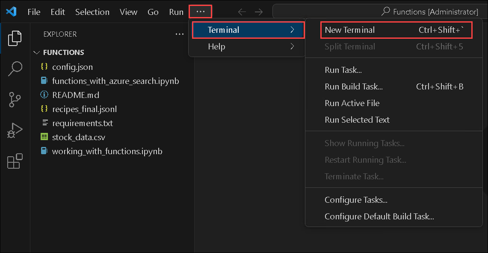
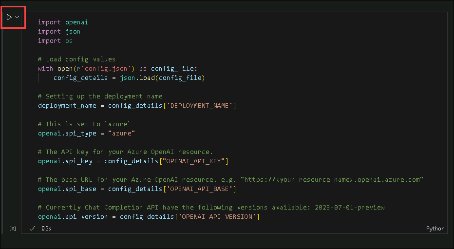

# Lab 2: Understand function calling in Open AI GPT

Over the last couple of years, language models like GPT-3 and GPT-4 have demonstrated their immense power and versatility. These models have been successfully applied in various scenarios, showcasing their capabilities. While these models are already valuable on their own, the Azure OpenAI Service now offers an exciting new feature called function calling. With function calling, the latest versions of GPT-3 and GPT-4 can generate structured JSON outputs based on functions specified in the request. This allows developers to integrate the models with other systems and tools, enabling even more possibilities. However, it's important to note that while the models can generate the function calls, the execution of these calls remains under your control, ensuring that you maintain full control over the process. In this overview, we will explore how function calling works, provide examples of its use cases, and guide you through the steps to leverage this powerful feature in Azure OpenAI Service. 

To know more about Azure function calling, please refer to [Function calling is now available in Azure OpenAI Service] (https://techcommunity.microsoft.com/t5/azure-ai-services-blog/function-calling-is-now-available-in-azure-openai-service/ba-p/3879241).


### Task 1: Understand Function calling

1. Open **Visual Studio Code** from the desktop; next, click on **File** and select **Open Folder**.

     

2. Navigate to the below-mentioned path and click on **Select folder**. 

    ```
    C:\LabFiles\openai\Basic_Samples\Functions
    ```

    

4. On the **Do you trust the authors of the files in this folder?** pop-up check the box next to **Trust the authors of all files in the parent folder 'Basic_Samples'**, and select **Yes, I trust the authors**.

     

5. In the **Functions** folder, open `config.json` and replace the following values with the ones you copied earlier. Next, press **CTRL + S** to save the file.

   | **Variables**                | **Values**                                                    |
   | ---------------------------- |---------------------------------------------------------------|
   | **DEPLOYMENT_NAME**          |  Replace the value with your **gpt-model** name               |
   | **OPENAI_API_BASE**          | **<inject key="OpenAIEndpoint" enableCopy="true"/>**          |
   | **OPENAI_API_KEY**           | **<inject key="OpenAIKey" enableCopy="true"/>**               |
   | **SEARCH_SERVICE_ENDPOINT**  | **<inject key="SearchServiceuri" enableCopy="true"/>**        |
   | **SEARCH_ADMIN_KEY**         | **<inject key="SearchAPIkey" enableCopy="true"/>**            |
   
    

7. Next, click on the **Eclipse Button (1)** on the top, then select **Terminal (2)** and click on **New Terminal (3)**.

     

8. In the new terminal, run the following command to install the required modules:

    ```
    pip install -r requirements.txt
    ```

9. Once the requirements are installed, close the terminal.

10. Open the `working_with_functions.ipynb` file from the left menu.

     

11. Click on the **Run (1)** button in the first cell. Once the pop-up `Install/Enable suggested extensions Python + Jupyter` appears, click on it to install the Python and Jupyter extensions. 

     

12. Next, on the **Choose a Kernel source** pop-up, select **Python Environments**. This will initiate the installation of the extension.

        

13. Next, on the **Select a Python Environment** pop-up, select **Python 3.11.5**. This will set the Python Environment. 

        

    > **Note**: If prompt **Runnning cells with 'c:\pytjon311\python.exe' requires the ipykernel package.** then click on **Install**.

      

14. Execute the notebook cell by cell (using either `Ctrl + Enter` to stay on the same cell or `Shift + Enter` to advance to the next cell) and observe the results of each cell execution.

       

       > **Note:** Please ensure to run the notebook end to end and observe the output for each cell. 
