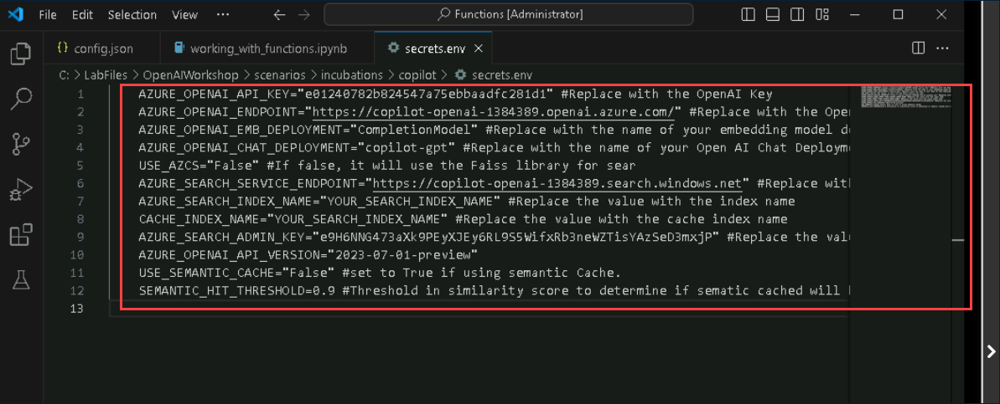
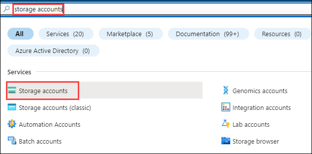
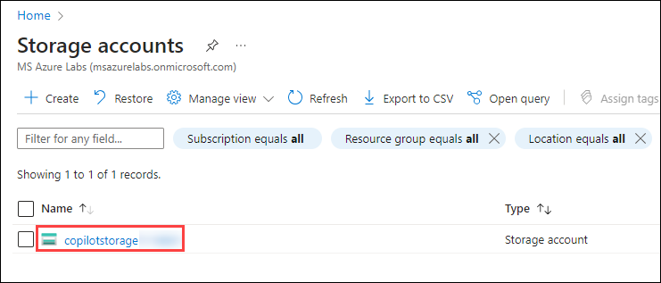
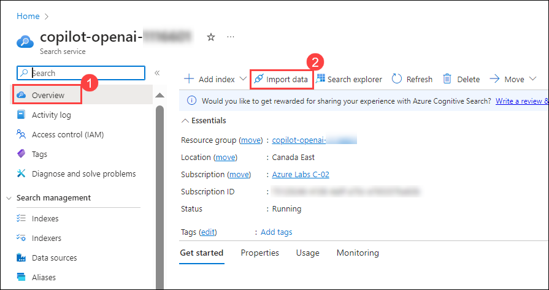
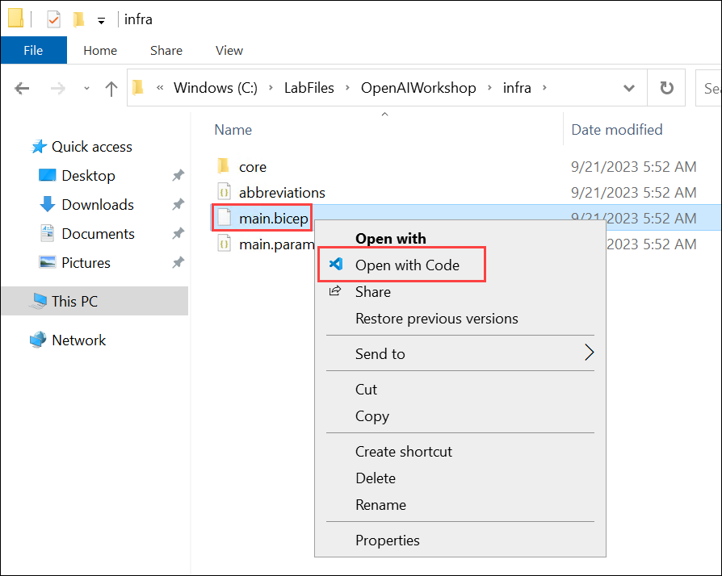
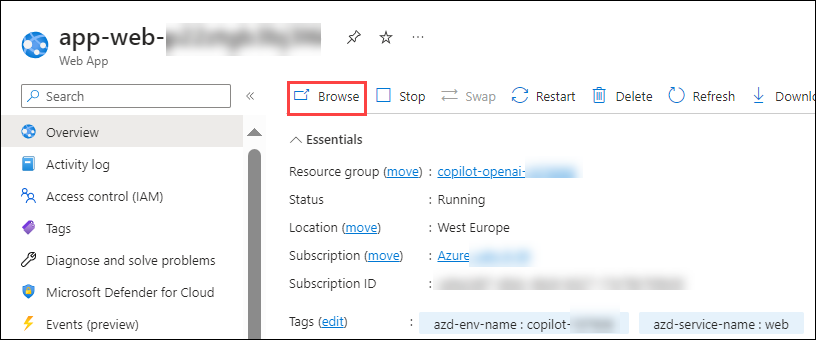

# Lab 3: Deploy and Run HR/Payroll Copilot Application 

   

**Application Platform:**
The solution is built on top of streamlit application platform. Streamlit allows the easy creation of interactive Python applications with the ability to render rich & responsive UI such as Chat UI and Python data visualization.

**Smart Agent: At the heart of the solution is the Python object Smart_Agent. The agent has the following components:**

  - **Goals/Tasks:** Smart_Agent is given a persona and instructions to follow to achieve certain goals, for example, HR Copilot is about helping answer HR/Payroll questions and update employee's personal information. This is done using instructions specified in the system message.

  - **NLP interaction & tool execution:** For the ability to use multiple tools and functions to accomplish business tasks, the function calling capability of the 0613 version is utilized to intelligently select the right function (validate identity/search knowledge base/update address/create ticket) based on the agent's judgment of what needs to be done. The agent is also able to engage with users following the instructions/goals defined in the system message.

  - **Memory:** The agent maintains a memory of the conversation history. The memory is backed by Streamlit's session state.
  - **LLM:** The agent is linked to a 0613 GPT-4 model to power its intelligence.

    
### Task 1: Build your own HR/Payroll copilot locally

1. In the LabVM, open File Explorer navigate to the `C:\Labfiles\OpenAIWorkshop\scenarios\incubations\copilot` path, right-click on the `secrets.env` file and select open with  **Visual Studio Code**.

    

1. The Visual Studio code is opened on the desktop. Edit the below code and update the **OpenAI Key**, **Embedding model and GPT model**, **OpenAI Endpoint**, and **Cognitive search endpoint**, values which you have copied and stored in the text file earlier.

   ```
      AZURE_OPENAI_API_KEY:'YOUR_OPENAI_KEY' //#Replace with the OpenAI Key.
      AZURE_OPENAI_ENDPOINT:'YOUR_OPENAI_ENDPOINT' //#Replace with the OpenAI Endpoint
      AZURE_OPENAI_EMB_DEPLOYMENT:'YOUR_EMBEDDING_MODEL' //#Replace with the name of your embedding model deployment.
      AZURE_OPENAI_CHAT_DEPLOYMENT:'YOUR_GPT_MODEL' //#Replace with the name of your Open AI Chat Deployment.
      AZURE_SEARCH_SERVICE_ENDPOINT:'YOUR_SEARCH_SERVICE_ENDPOINT' //#Replace with Search Service Endpoint.
   ```

1. After updating values the `secrets.env` file should be as shown in the below screenshot, press **CTRL + S** to save the file.

    

1. To run the application from the command line, navigate to Command Prompt and run the below command:

   >**Note**: Here, you can enter your email address below to get notifications. Otherwise, leave this field blank and click on **Enter**.

   ```
   cd C:\Labfiles\OpenAIWorkshop\scenarios\incubations\copilot\employee_support
   streamlit run hr_copilot.py
   ```

1. Once the execution of `streamlit run hr_copilot.py` is completed. A locally hosted HR Copliot application will be opened in the web browser. 

   
   

1. Run the following query to validate the identity of the employee.

   ```
   John 1234
   ```

   

1. Enter an example question such as `When will I receive W2 form?`. The questions are answered by the Copilot by searching a knowledge base and providing the answer.

   

1. Copilot also can help update employee information like address updates. For other information update requests, Copilot will log a ticket to the HR team to update the information. Enter `I moved to 123 Main St, San Jose, CA 95112, please update my address` in the HR Copilot app.

    

### Task 2: Integrate Azure Cognitive Search with your Application

1. In the **Azure Portal**, search and select **Storage accounts**. 

    

1. From the **Storage account** page, select **copilotstorage<inject key="Deployment ID" enableCopy="false"/>**.

    

1. From the left menu select **Access keys** under **Security + networking** section. Copy the **Connection string** and store it in a text file for later use.   

    

1. Next, navigate to **Azure OpenAI**, select **Cognitive search (1)** from the left menu and click on **copilot-openai-<inject key="Deployment ID" enableCopy="false"/> (2)**.

   

1. On the **Overview (1)** page, click on **Import data (2)**.

    

1.  Select **Azure Blob storage** as the **Data source**.

    

1. On the **Connect to your data** tab, provide the following details and click on **Next Add cognitive skills (Optional) (7)**.

   | Settings| value|
   |---|---|
   |Data source name| **copilotstorage<inject key="Deployment ID" enableCopy="false"/>** **(1)**|
   |Data to extract| **Content and metadata** **(2)**|
   |Parsing mode| **JSON** **(3)**|
   |Connection string | **YOUR_STORAGE_ACCOUNT_CONNECTIONSTRING (4)**|
   |Container name| **data (5)**|
   |Blob folder| **data/ (5)**|

   

1. On the **Add cognitive skills (optional)** tab leave default and click on **Skip to: Customize target index**

1. Click on **Keys** from the left menu, copy the **Primary admin keys**, and store them in a text file for later use.

    

1. In the LabVM, open File Explorer navigate to the `C:\Labfiles\OpenAIWorkshop\scenarios\incubations\copilot` path, right-click on the `secrets.env` file and select open with  **Visual Studio Code**.

    

1. The Visual Studio code is opened on the desktop. replace the following values and press **CTRL + S** to save the file.

   - **USE_AZCS**="**True**" #Set the value to True
   - **AZURE_SEARCH_INDEX_NAME**="YOUR_SEARCH_INDEX_NAME #Replace the value with the index name
   - **CACHE_INDEX_NAME**="YOUR_SEARCH_INDEX_NAME" #Replace the value with the cache index name
   - **AZURE_SEARCH_ADMIN_KEY**="YOUR_SEARCH_INDEX_NAME_KEY" #Replace the value with the Primary admin key
 

### Task 3: Deploy HR/Payroll copilot application to Azure

1. In the LabVM, open File Explorer navigate to the `C:\LabFiles\OpenAIWorkshop\infra` path, right-click on the `main.bicep` file, and select open with  **Visual Studio Code**.

    

1. In the **appsettings** section of `main.bicep` file, replace the values below with the ones you copied previously in the text editor. Next, press **CTRL + S** to save the file.

      ```
      AZURE_OPENAI_API_KEY:'YOUR_OPENAI_KEY' //#Replace with the OpenAI Key.
      AZURE_OPENAI_ENDPOINT:'YOUR_OPENAI_ENDPOINT' //#Replace with the OpenAI Endpoint.
      AZURE_OPENAI_EMB_DEPLOYMENT:'YOUR_EMBEDDING_MODEL' //#Replace with the name of your embedding model deployment.
      AZURE_OPENAI_CHAT_DEPLOYMENT:'YOUR_GPT_MODEL' //#Replace with the name of your Open AI Chat Deployment.
      AZURE_SEARCH_SERVICE_ENDPOINT:'YOUR_SEARCH_SERVICE_ENDPOINT' //#Replace with Search Service Endpoint.
      ```

     


1. In the LabVM, navigate to Desktop and search for `cmd` in the search box then click on **Command Prompt**.

1. Run the below command to change the directory.

   ```bash
   cd C:\LabFiles\OpenAIWorkshop
   ```

1. Run the below command to **Authenticate with Azure**. It will redirect to the Azure Authorize website, select your account.

   ```bash
   azd auth login
   ```

1. Run the below command to set up the resource group deployment and **Create a new environment**. Make sure to replace `{DeploymentId}` with **<inject key="Deployment ID" enableCopy="true"/>** in the below command.

   ```bash
   azd config set alpha.resourceGroupDeployments on
   ```
   
   ```bash
   azd env new copilot-{DeploymentId}
   ```

1. Run the below command to Provision Azure resources, and deploy your project with a single command.

   ```bash
   azd up
   ```
   
1. Please select your Azure Subscription to use, enter `1`, and click on the **Enter** button.

   

1. Please select an Azure location to use, select the location as **<inject key="Region" enableCopy="false"/>** location, and click on the **Enter** button. You can change the location using the up and down arrow.

    

1. Next, select **copilot-openai-<inject key="Deployment ID" enableCopy="False"/>** resource group and hit **ENTER**.

    

1. Once the deployment succeeded, you will see the following message **SUCCESS: Your application was provisioned and deployed to Azure**. The deployment might take 5 - 10 minutes. It is producing a web package file, then creating the resource and publishing the package to the app service.


1. Navigate back to the Azure portal, search, and select **App service**. Select the available web app that you have deployed in the previous step.

    

1. Next, click on **Browse** to open your Web application.

    

    

   > **Note**: If an issue occurs when you try to launch the app service, please restart the app service and wait five minutes before trying to launch the app again.
