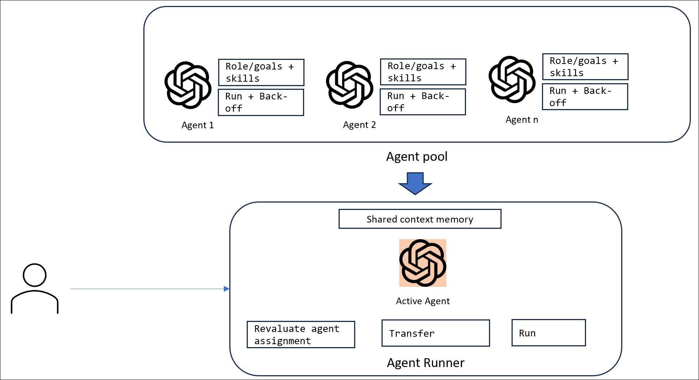
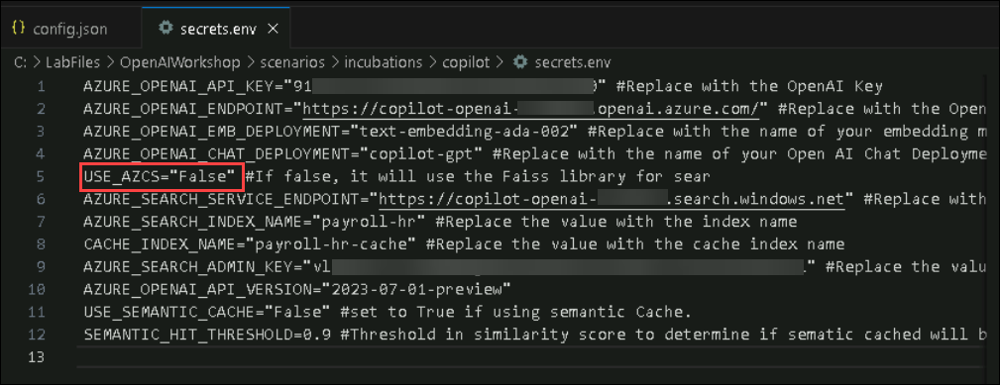
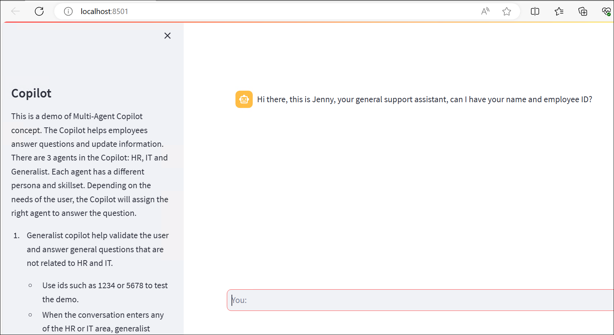
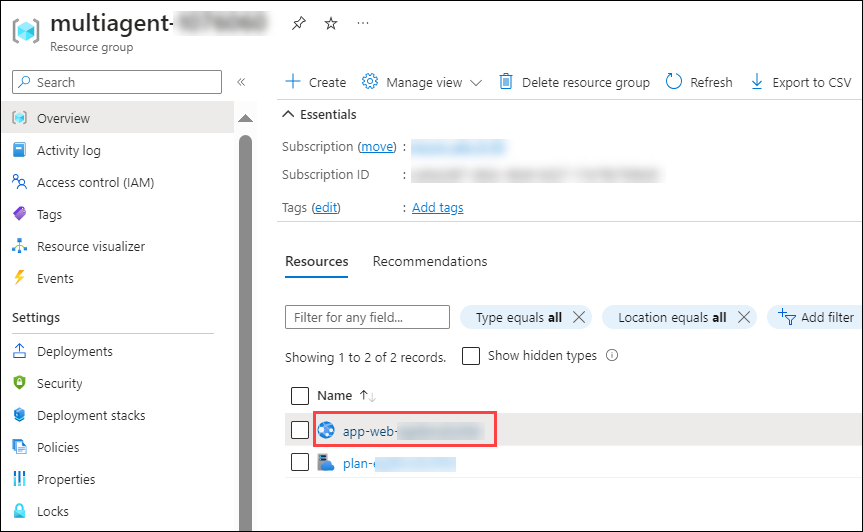
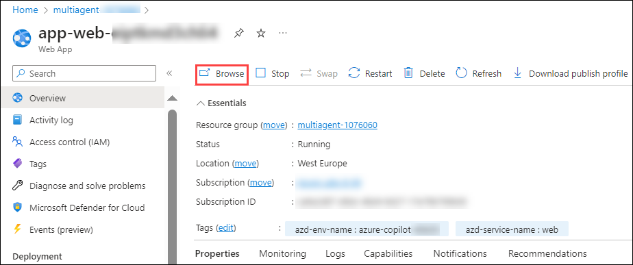

# Lab 4: Understand HR Copilot Demo Application 

When the scope of automation spans across multiple functional domains, like humans, an agent may perform better when it can specialize in a single area. So instead of stuffing a single agent with multiple capabilities, we can employ a multiple-agent model, each specializing in a single domain. These agents are managed and coordinated by a manager agent (agent runner). This is called the multi-agent copilot model. The agent runner is responsible for promoting the right agent from the agent pool to be the active agent to interact with the user. It is also responsible for transferring relevant context from agent to agent to ensure continuity. In this model, the agent runner relies on the specialist agent's cue to back off from the conversation to start the transfer. Each specialist agent has to implement a skill to send a notification (back-off method) when it thinks its skillset cannot handle the user's request. On the other hand, the decision on exactly which agent should be selected to take over the conversation is still with the agent runner. When receiving such a request, the agent runner will review the input from the requesting agent to decide which agent to select for the job. This skill also relies on a LLM. The agent runner runs each specialist agent's run method. There can be some persistent context that should be available across agents' sessions. This is implemented as the persistent memory at agent runner. Each specialist agent, depending on the requirement for skill, can be powered by a gpt-35-turbo or gpt-4. The multi-agent solution has the same application platform (streamlit) as the single HR Copilot.




## Exercise 1: Deploy and run the multi-agent Copilot application

### Task 1: Build your own multi-agent Copilot application locally

Before we proceed further, In the LabVM, open File Explorer, navigate to the `C:\Labfiles\OpenAIWorkshop\scenarios\incubations\copilot` path, right-click on the `secrets.env` file, and select open with **Visual Studio Code**.

 

- Replace **USE_AZCS**="**False**" in the Visual Studio code, then press **CTRL + S** to save the file.

   

1. In the LabVM, navigate to Desktop and search for `cmd` in the search box, then click on **Command Prompt**.

2. Run the below command to change the directory.

   ```
   cd C:\LabFiles\OpenAIWorkshop\scenarios\incubations\copilot\employee_support
   ```

3. To run the application from the command line, navigate back to Command Prompt and run the below command:

   >**Note**: Here, you can enter your email address below to get notifications. Otherwise, leave this field blank and then click on **Enter**.

   ```
   streamlit run multi_agent_copilot.py
   ```

4. Once the execution of `streamlit run multi_agent_copilot.py` is completed, a locally hosted HR Copliot application will be opened in the web browser. 

   

   

5. Run the following query to validate the identity of the employee:

   ```
   Sharon 1234
   ```

   

6. Enter an example question such as `How do I reset my password?`. The questions are answered by the Copilot by searching a knowledge base.

   

7. Navigate back to **CMD** and stop the terminal by typing **ctrl + C**.
   
### Task 2: Deploy a multi-agent Copilot application to Azure

1. In the LabVM, open File Explorer, navigate to the `C:\LabFiles\OpenAIWorkshop\infra` path, right-click on the `main.bicep` file, and select open with  **Visual Studio Code**.

    

2. In the `main.bicep` file, replace the file name in **Line 49** with `multi_agent_copilot.py` and press **CTRL + S** to save the file.

    

3. In the LabVM, navigate to Desktop and search for `cmd` in the search box, then click on **Command Prompt**.

4. Run the below command to change the directory.

   ```bash
   cd C:\LabFiles\OpenAIWorkshop
   ```

5. Run the below command to **Authenticate with Azure**. It will redirect you to the Azure Authorize website, where you can select your account.

   ```bash
   azd auth login
   ```

6. Run the below command to set up the resource group deployment and **Create a new environment**. Make sure to replace `{DeploymentId}` with **<inject key="Deployment ID" enableCopy="true"/>** in the below command.

   ```bash
   azd config set alpha.resourceGroupDeployments on
   ```
   
   ```bash
   azd env new azure-copilot-{DeploymentId}
   ```

7. Run the below command to provision Azure resources and deploy your project with a single command.

   ```bash
   azd up
   ```
   
8. Please select your Azure subscription to use, enter `1`, and click on the **Enter** button.

   

9. Please select an Azure location to use, select the location as **<inject key="Region" enableCopy="false"/>** location, and click on the **Enter** button. You can change the location using the up and down arrows.

   

10. Next, select the **multiagent-<inject key="Deployment ID" enableCopy="False"/>** resource group and hit **ENTER**.

    

11. Once the deployment succeeds, you will see the following message **SUCCESS: Your application was provisioned and deployed to Azure**. The deployment might take 5-10 minutes. It is producing a web package file, then creating the resource and publishing the package to the app service.


12. Navigate back to the Azure portal and select **App service** from the **multiagent-<inject key="Deployment ID" enableCopy="False"/>** resource group.

    

13. Next, click on **Browse** to open your Web application.

    

    

   > **Note**: If an issue occurs when you try to launch the app service, please restart the app service and wait five minutes before trying to launch the app again.
