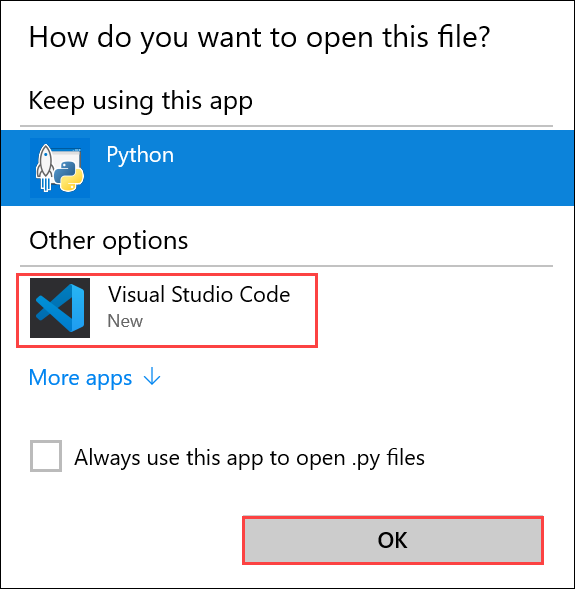
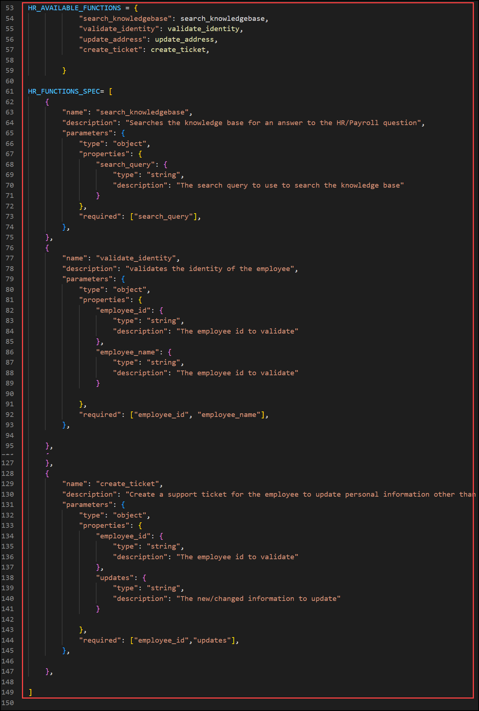
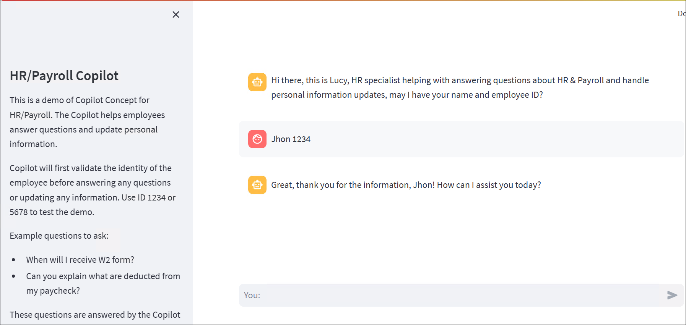

# Lab 2: Understand function calling in Open AI GPT

Over the last couple of years, language models like GPT-3 and GPT-4 have demonstrated their immense power and versatility. These models have been successfully applied in various scenarios, showcasing their capabilities. While these models are already valuable on their own, Azure OpenAI Service now offers an exciting new feature called function calling. With function calling, the latest versions of GPT-3 and GPT-4 can generate structured JSON outputs based on functions specified in the request. This allows developers to integrate the models with other systems and tools, enabling even more possibilities. It's important to note that while the models can generate the function calls, the execution of these calls remains under your control, ensuring that you maintain full control over the process. In this overview, we will explore how function calling works, provide examples of its use cases, and guide you through the steps to leverage this powerful feature in Azure OpenAI Service. 

To know more about Azure Function calling please refer [Function calling is now available in Azure OpenAI Service](https://techcommunity.microsoft.com/t5/azure-ai-services-blog/function-calling-is-now-available-in-azure-openai-service/ba-p/3879241).

## Exercise 1: Deploy and Run HR/Payroll Copilot Application 

   

**Application Platform:**
The solution is built on top of streamlit application platform. Streamlit allows easy creation of interactive Python application with ability to render rich & responsive UI such as Chat UI and Python data visualization.

**Smart Agent:At the heart of the solution is the python object Smart_Agent. The agent has following components:**

  - **Goals/Tasks:** Smart_Agent is given a persona and instructions to follow to achieve certain goals, for example for HR Copilot it is about helping answer HR/Payroll question and update employee's personal information. This is done using instructions specified to the system message.

  - **NLP interacation & tool execution:** For the abilility to use multiple tools and functions to accomplish business tasks, function calling capability of 0613 version is utilized to intelligently select the right function (validate identity/search knowlege base/update address/create ticket) based on the agent's judgement of what need to be done. The agent is also able to engage with users following the instruction/goals defined in the system message.

  - **Memory:** The agent maintain a memomory of the conversation history. The memory is backed by Streamlit's session state.
  - **LLM:** The agent is linked to a 0613 GPT-4 model to power its intelligence.

### Task 1: Understand Function calling (Read-Only)

1. In the LabVM, open File Explorer naviagte to the `C:\Labfiles\OpenAIWorkshop\scenarios\incubations\copilot\employee_support` path, open hr_copilot_utils.py, and select Open with  **Visual Studio Code** click on **OK**. Take a look at the code to see function calling works.

    

2. The code snippet here provides a persona description for an **HR support specialist** named Lucy. Lucy's role is to assist employees with HR and Payroll-related questions and handle personal information updates. 

    
   
3. In the code snippet, you can see how the different function specifications are defined, each specification will help find relevant answers to HR and Payroll questions.

    

4. Once the application runs you will observe how the function is called and details are fetched.

    

 
  **Here is the flow of fuction calling:**
  
  - **Check If Model Wants to Use a Function**: This step involves the user (or model) initiating a conversation with the LLM and expressing a desire to perform a specific function or task.
  
  - **Get Function Names and Parameters from Model**: Once the desire to perform a function is expressed, the LLM would need to understand which function is requested and what parameters or information are required to execute that function. The user (or model) provides this information.
  
  - **Execute Function**: With the function name and parameters in hand, the LLM performs the requested function. The complexity of the function can vary widely, from simple calculations to more complex tasks like searching for information, generating content, or interacting with external systems.
  
  - **Get Function Output & Augment It**: After executing the function, the LLM obtains the output or result of that function. Depending on the nature of the function and the user's (or model's) instructions, the LLM might augment or modify the output in some way. This augmentation could involve formatting, summarizing, or enhancing the output.
  
  - **Send Augmented Output to LLM**: The augmented output is then sent as input to the language model (LLM) for further processing or interaction. This step may involve providing additional context or asking follow-up questions based on the output of the function.
  
  - **Get LLM's Response**: The LLM receives the augmented output as input and generates a response based on that input. The response can be in the form of text or other relevant information. The LLM's response can include explanations, clarifications, or further actions based on the function's output.

### Task 2: Build your own HR/Payroll copilot locally

1. In the LabVM, navigate to Desktop and search for `cmd` in the search box then click on **Command Prompt**.

2. Run the below command to change the directory.

   ```
   cd C:\LabFiles\OpenAIWorkshop-Automation\scenarios\incubations\copilot
   ```

3. Provide settings for Open AI and Database by creating a ```secrets.env``` file in the root of this folder by running the below command.

   ```
   code secrets.env
   ```
4. You will see the Visual Studio code is opened in the desktop. Enter the below code and update the OpenAI Key, Model Name and Endpoint values which you have copied and stored in text file earlier.

   ```
   AZURE_OPENAI_API_KEY="********************************" #Replace with the OpenAI Key
   AZURE_OPENAI_GPT4_DEPLOYMENT="NAME_OF_GPT_4_DEPLOYMENT" #Replace with the OpenAI Model Name
   AZURE_OPENAI_ENDPOINT=https://openairesourcename.openai.azure.com/ #Replace with the OpenAI Endpoint
   USE_AZCS="False"
   AZURE_OPENAI_API_VERSION="2023-05-01"
   USE_SEMANTIC_CACHE="False"
   SEMANTIC_HIT_THRESHOLD=0.9
   ```

5.  After updating values the `secrets.env` file should be as shown in the below screenshot, press **CTRL + S** to save the file.

    

6. To run the application from the command line navigate back to Command Prompt and run the below command:

   >**Note**: Here, you can enter your email address below to get notifications. Otherwise, leave this field blank and click on **Enter**.

   ```
   cd employee_support
   streamlit run hr_copilot.py
   ```

7. Once the execution of `streamlit run app.py` is completed. A locally hosted HR Copliot appliation will be opened in the web browser. 

   
   

8. Run the following query to validate the identity of the employee.

   ```
   Jhon 1234
   ```

   

9. Enter an example question such as `When will I receive W2 form?`. The questions are answered by the Copilot by searching a knowledge base and providing the answer.

   

10. Copilot also can help update employee information like address update. For other information update requests, the Copilot will log a ticket to the HR team to update the information. Enter 'I moved to 123 Main St, San Jose, CA 95112, please update my address' in the HR Copilot app.

    
