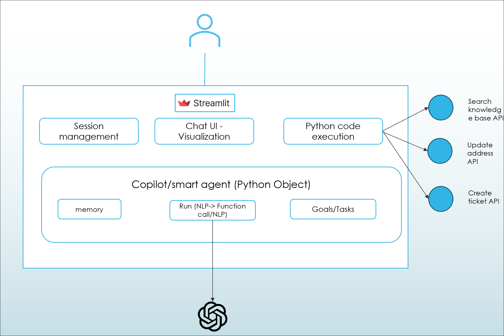

# Lab 2: Understand function calling in Open AI GPT

Over the last couple of years, language models like GPT-3 and GPT-4 have demonstrated their immense power and versatility. These models have been successfully applied in various scenarios, showcasing their capabilities. While these models are already valuable on their own, Azure OpenAI Service now offers an exciting new feature called function calling. With function calling, the latest versions of GPT-3 and GPT-4 can generate structured JSON outputs based on functions specified in the request. This allows developers to integrate the models with other systems and tools, enabling even more possibilities. It's important to note that while the models can generate the function calls, the execution of these calls remains under your control, ensuring that you maintain full control over the process. In this overview, we will explore how function calling works, provide examples of its use cases, and guide you through the steps to leverage this powerful feature in Azure OpenAI Service. 

To know more about Azure Function calling please refer [Function calling is now available in Azure OpenAI Service](https://techcommunity.microsoft.com/t5/azure-ai-services-blog/function-calling-is-now-available-in-azure-openai-service/ba-p/3879241).

## Exercise 1: Deploy and Run HR/Payroll Copilot Application 

### Task 1: Build your own HR/Payroll copilot locally

   

**Application Platform:**
The solution is built on top of streamlit application platform. Streamlit allows easy creation of interactive Python application with ability to render rich & responsive UI such as Chat UI and Python data visualization.

**Smart Agent:At the heart of the solution is the python object Smart_Agent. The agent has following components:**

  - **Goals/Tasks:** Smart_Agent is given a persona and instructions to follow to achieve certain goals, for example for HR Copilot it is about helping answer HR/Payroll question and update employee's personal information. This is done using instructions specified to the system message.

  - **NLP interacation & tool execution:** For the abilility to use multiple tools and functions to accomplish business tasks, function calling capability of 0613 version is utilized to intelligently select the right function (validate identity/search knowlege base/update address/create ticket) based on the agent's judgement of what need to be done. The agent is also able to engage with users following the instruction/goals defined in the system message.

  - **Memory:** The agent maintain a memomory of the conversation history. The memory is backed by Streamlit's session state.
  - **LLM:** The agent is linked to a 0613 GPT-4 model to power its intelligence.

1. In the LabVM, navigate to Desktop and search for `cmd` in the search box then click on **Command Prompt**.

